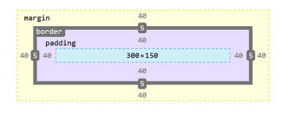
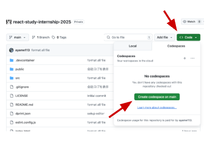
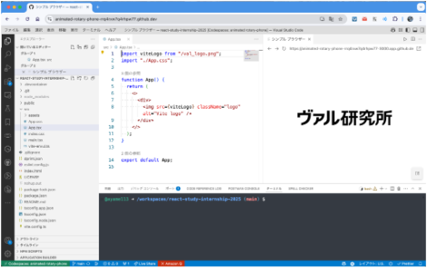

株式会社ヴァル研究所

# TypeScript勉強会 for Internship

maas開発部
mixway team　鈴木 涼平

---

# 講師自己紹介

## ヴァル研究所 鈴木 涼平

<div class="flex">
  
  <div class="flex-grow">

    2024年 新卒入社
    2024年7月〜 mixway APIの開発・運用
    2025年6月〜 AIプロジェクト参加

    一昨日、会社の近くを歩いていたら、お笑い芸人の方にテレビのインタビューを受けました！

</div>
</div>

---

# もくじ

- **導入** - 本日の内容について説明
- **第一章** - Webページが表示されるしくみ
- **第二章** - HTML, CSS, JavaScriptの基本文法
- **第三章** - TypeScriptの基礎
- **第四章** - React
- **演習問題** - 外部APIからデータを取得しReactで表示してみよう

---

# 本日の勉強会の内容について

---

## 今日やること

- 今後開催されるインターンシップに向けて、Webプログラミング(React + TypeScript)の基礎を学ぶ

- 17時台 ・・・ 講義メイン

  - **第一章** - Webページが表示されるしくみ
  - **第二章** - HTML, CSS, JavaScriptの基本文法
  - **第三章** - TypeScriptの基礎
  - **第四章** - React

- 17:45〜 質疑応答
- 17:55〜 休憩
- 18:05〜 ・・・ 演習問題

  - 手を動かして実際にReactでWebサイトを作ってみましょう！

---

## 今日のゴール

- Webページが表示されるしくみを学ぶ
- ReactとTypeScriptによるWebプログラミングを体験する

---

## ⚠️ 注意事項

- この勉強会内では、AIを活用してOKです。
- 質問や疑問点があったら、マイクをonにして声をかけるか、チャットで質問してください。
  - 質疑応答の時間も設けます
- この講義資料は公開しています。

---

# 〜第一章〜　Webページが表示されるしくみ

---

## まず初めにアンケート

Webサイトを自分で作ったことがある or Webサイトの作り方を学んだことがある人は手を挙げてみてください！

※ 当てたりしないので、気軽に手を挙げてください :bow:

---

## アンケートその2

Web APIを使ったことがある or Web APIの使い方を学んだことがある人は手を挙げてみてください！

※ 当てたりしないので、気軽に手を挙げてください :bow:

---

## Webページが表示されるまで

ブラウザのアドレスバーにURLを入力した後、
どのようにWebページが表示されるのかを学んでいきましょう。


---

## Webページが表示されるまで

ブラウザのアドレスバーに **URL** を入力すると...

1. **DNS解決** - ドメイン名をIPアドレスに変換
2. **HTTP/HTTPSリクエスト** - サーバーにリクエスト送信
3. **サーバー処理** - リクエストを処理してレスポンス生成
4. **レスポンス受信** - HTML, CSS, JSファイルを受信
5. **レンダリング** - ブラウザがWebページを表示

---

## クライアント・サーバー通信

```
[ブラウザ] ----HTTP Request----> [Webサーバー]
     ↑                              ↓
     +-------HTTP Response----------+
              (HTML,CSS,JS)
```

**例：駅すぱあとfor webの場合**

- ユーザーが出発駅・到着駅を入力
- サーバーが経路計算を実行
- 結果をHTMLで返却して表示

---

## IPアドレスとドメイン名

### IPアドレス

- **192.168.1.1** のような数字の組み合わせ
- コンピューター同士が通信するための住所
- 人間には覚えにくい...😅

### ドメイン名

- **google.com**, **github.com** のような文字列
- 人間が覚えやすい形式
- **DNS**（Domain Name System）でIPアドレスに変換

```
google.com → DNS → 172.217.175.238
```

---

## HTTPとHTTPS

### HTTP（HyperText Transfer Protocol）

- Webページを送受信するためのルール
- **ポート80** で通信
- データが暗号化されていない ⚠️

### HTTPS（HTTP Secure）

- HTTPに **SSL/TLS暗号化** を追加
- **ポート443** で通信
- 🔒 **セキュア** - パスワードや個人情報も安全

**現在はHTTPSが標準** - ブラウザも推奨！

---

## Webページを構成する3つの技術

| 技術           | 役割                   | 例                             |
| -------------- | ---------------------- | ------------------------------ |
| **HTML**       | 構造・内容             | 文章、見出し、リンク           |
| **CSS**        | デザイン・見た目       | 色、レイアウト、アニメーション |
| **JavaScript** | 動作・インタラクション | ボタンクリック、データ取得     |

これらを **組み合わせて** Webページを作ります

---

## レスポンスの中身を見てみよう

### ブラウザの開発者ツール

**F12** または **右クリック → 検証** で開く

1. **Elements** - HTML構造
2. **Network** - 通信内容
3. **Console** - JavaScript実行結果

### 実際にやってみよう！

1. 好きなWebサイトを開く
2. F12で開発者ツールを開く
3. Networkタブで通信を確認

---

# 〜第二章〜　HTML, CSS, JavaScriptの基本文法

---

## HTML（HyperText Markup Language）

**役割：** Webページの構造と内容を定義

- タグ `<xxx></xxx>` でWebページの構造を記述します

```
<div>テキスト</div>
  │    │      └─ 終了タグ
  │    └─ 内容
  └─ 開始タグ
```

- タグは入れ子にできます

```
<div>
  <h1>見出し</h1>
  <p>段落のテキスト</p>
</div>
```

---

## HTML（HyperText Markup Language）

HTMLの例

```html
<!DOCTYPE html>
<html>
<head>
    <title>ページタイトル</title>
</head>
<body>
    <h1>見出し</h1>
    <p>段落のテキスト</p>
    <button>ボタン</button>
</body>
</html>
```

**主要タグ：** `<div>`, `<p>`, `<h1>〜<h6>`, `<button>`, `<input>`, ``

---

# 主要なHTMLタグ

<div class="flex">
<div class="flex-grow">

```
<h1>見出し1</h1>
<h2>見出し2</h2>
<h3>見出し3</h3>
<p>段落のテキスト</p>
```

</div>

<p>→</p>

<div class="flex-grow">
<h1>見出し1</h1>
<h2>見出し2</h2>
<h3>見出し3</h3>
<p>段落のテキスト</p>
</div>
</div>

---

## HTMLの基本構造

```html
<!DOCTYPE html>  <!-- HTML5であることを宣言 -->
<html lang="ja">  <!-- 言語設定 -->
<head>
    <!-- ページのメタ情報 -->
    <meta charset="UTF-8">
    <meta name="viewport" content="width=device-width, initial-scale=1.0">
    <title>ページタイトル</title>
    <link rel="stylesheet" href="style.css">
</head>
<body>
    <!-- 実際に表示される内容 -->
    <header>ヘッダー</header>
    <main>メインコンテンツ</main>
    <footer>フッター</footer>
</body>
</html>
```

---

## よく使うHTMLタグ

### テキスト関連

<div class="flex">
<div class="flex-grow">

```
<h1>大見出し</h1>
<h2>中見出し</h2>
<p>段落のテキスト</p>
<span>通常のテキスト</span> <strong>強調</strong> <em>斜体</em>
```

</div>

<p>→</p>

<div class="flex-grow">
<h1>大見出し</h1>
<h2>中見出し</h2>
<p>段落のテキスト</p>
<span>通常のテキスト</span> <strong>強調</strong> <em>斜体</em>
</div>
</div>

---

## よく使うHTMLタグ

### リスト

<div class="flex">
<div class="flex-grow">

```html
<ul>  <!-- 順序なしリスト -->
    <li>項目1</li>
    <li>項目2</li>
</ul>
<ol>  <!-- 順序ありリスト -->
    <li>手順1</li>
    <li>手順2</li>
</ol>
```

</div>

<p>→</p>

<div class="flex-grow">
<ul>  <!-- 順序なしリスト -->
    <li>項目1</li>
    <li>項目2</li>
</ul>
<ol>  <!-- 順序ありリスト -->
    <li>手順1</li>
    <li>手順2</li>
</ol>
</div>
</div>

---

## 入力要素

```html
<form>
    <label for="name">名前:</label>
    <input type="text" id="name" name="name" required>
    
    <label for="email">メール:</label>
    <input type="email" id="email" name="email">
    
    <label for="message">メッセージ:</label>
    <textarea id="message" name="message"></textarea>
    
    <button type="submit">送信</button>
</form>
```

### 入力タイプ

`text`, `email`, `password`, `number`, `date`, `checkbox`, `radio`

---

## CSS（Cascading Style Sheets）

**役割：** HTMLの見た目・デザインを制御

### CSSでできること

- **色・フォント** - テキストの色やフォントサイズを変更
- **レイアウト** - 配置を横並びにするなど
- **アニメーション** - 要素の動きをつける
- **レスポンシブデザイン** - 画面サイズに応じてスタイルを変える

---

## CSS（Cascading Style Sheets）の例

`article`クラスを持つHTML要素にスタイルを適用する例です。

```css
.article {
  color: blue; /* 文字色を青色に */
  background-color: #f0f0f0; /* 背景色を薄いグレーに */
  font-size: 2em; /* フォントサイズを2倍に */
  text-align: center; /* 中央揃え */
}
```

```html
<div class="article">
  <h1>記事タイトル</h1>
  <p>記事の内容がここに入ります。</p>
</div>
```

`class="article"`を持つHTML要素に対して、CSSでスタイルを適用しています。

---

```css
/* セレクタ { プロパティ: 値; } */
h1 {
  color: blue; /* 文字色を青色に */
  font-size: 24px; /* フォントサイズの変更 */
  text-align: center; /* 中央揃え */
}

.button {
  background-color: #007bff; /* 背景色 */
  color: white; /* 文字色 */
  padding: 10px 20px; /* 要素の間隔 */
  border: none; /* 枠線 */
  border-radius: 4px; /* 角丸 */
}
```

---

## CSSセレクタの種類

```css
/* 要素セレクタ */
/* <h1>要素に対するスタイル */
h1 {
  color: blue;
}

/* クラスセレクタ */
/* class="button" を持つ要素に対するスタイル */
.button {
  background: red;
}

/* IDセレクタ */
/* id="header" を持つ要素に対するスタイル */
#header {
  height: 80px;
}

/* 属性セレクタ */
/* <input type="text"> に対するスタイル */
input[type="text"] {
  border: 1px solid gray;
}

/* 疑似クラス */
/* <a>要素にマウスをホバーした時のスタイル */
a:hover {
  color: red;
}
/* <button>要素が無効な時のスタイル */
button:disabled {
  opacity: 0.5;
}

/* 子要素セレクタ */
/* nav要素の直下にあるul要素 */
nav > ul {
  list-style: none;
}
```

---

## CSSボックスモデル

```css
.box {
  width: 300px; /* 幅 */
  height: 150px; /* 高さ */
  padding: 40px; /* 内余白 */
  border: 5px solid black; /* 境界線 */
  margin: 40px; /* 外余白 */
}
```



---

## JavaScript

**役割：** プログラミングを使ってWebページに動的な機能を追加

```javascript
// 変数の宣言
const userName = "田中";
let counter = 0;

// ログ出力
console.log(`こんにちは、${userName}さん！`);

// 関数の定義
function greet(name) {
  return `こんにちは、${name}さん！`;
}

// アロー関数
const add = (a, b) => a + b;
```

---

## JavaScriptの基本文法

### テンプレートリテラル

```javascript
const name = "田中";
const age = 25;

const message2 = `私の名前は${name}で、${age}歳です。`;
```

### 分割代入

```javascript
// 配列の分割代入
const [first, second] = ["りんご", "バナナ"];

// オブジェクトの分割代入
const user = { name: "田中", age: 25 };
const { name, age } = user;
```

---

## 配列の便利メソッド

```javascript
const numbers = [1, 2, 3, 4, 5];

// map - 各要素を変換
const doubled = numbers.map(n => n * 2);
// [2, 4, 6, 8, 10]

// filter - 条件に合う要素を抽出
const evens = numbers.filter(n => n % 2 === 0);
// [2, 4]

// reduce - 累積処理
const sum = numbers.reduce((acc, n) => acc + n, 0);
// 15

// find - 条件に合う最初の要素
const found = numbers.find(n => n > 3);
// 4
```

---

## JavaScriptの配列・オブジェクト

```javascript
// 配列
const fruits = ["りんご", "バナナ", "オレンジ"];
fruits.map(fruit => `美味しい${fruit}`);

// オブジェクト
const user = {
  name: "田中太郎",
  age: 25,
  email: "tanaka@example.com",
};

// 分割代入
const { name, age } = user;
console.log(`${name}さんは${age}歳です`);
```

---

## 非同期処理（async/await）

```javascript
// 外部APIからデータを取得
async function fetchUserData(userId) {
  try {
    const response = await fetch(`/api/users/${userId}`);
    const userData = await response.json();
    return userData;
  } catch (error) {
    console.error("エラーが発生しました:", error);
  }
}

// 使用例
const user = await fetchUserData(123);
console.log(user.name);
```

---

## JavaScriptによるWeb API連携の例

Web APIは、HTTPを使ってデータをやり取りする仕組みです。

Webページの中から、外部と通信してデータを取得したり、送信したりすることができます。

```
[ブラウザ] ----HTTP Request----> [Web APIサーバー]
     ↑                              ↓
     +-------HTTP Response----------+
              (JSONデータ)
```

---

## Web API連携の例

事前のプログラミング課題の例

```typescript
const keyword = "サウス";
const number = 2;
const condition = "onsen,parking";
// リクエストURL組み立て
const url = new URL(
  "https://challenge-server.tracks.run/hotel-reservation/hotels",
);
url.searchParams.append("keyword", keyword);
url.searchParams.append("number", number.toString());
url.searchParams.append("condition", condition);
// リクエスト送信
const response = await fetch(url, {
  headers: { "X-ACCESS-TOKEN": "0111e7a5-de02-4703-b0cc-b01a8a65c511" },
});
const data = await response.json();
console.log(data); // 結果
```

---

# 〜第三章〜　TypeScriptの基礎

---

# の前に、みなさんの手元で演習環境を立ち上げたいと思います！

---

# 演習環境の立ち上げ

- GitHub Codespaceというサービスを使います。
  - https://github.com/ValLaboratory/react-study-internship-2025
- 次の講義では、演習環境に事前に用意したコードを眺めながら進めていきます。
- その後の演習パートでは、実際に演習環境でコードを書いてもらいます。

- 開発環境の立ち上げは、演習パートの開始(18:05ごろ)までに終わっていれば大丈夫です！

---

# 演習環境の立ち上げ 1

https://github.com/ValLaboratory/react-study-internship-2025

- GitHubリポジトリを開き、画面右上の `Code▼` から、`Create codespaces on main` をクリックして、演習環境を立ち上げます。
  - 演習環境は個人ごとに用意されています。



---

# 演習環境の立ち上げ 2

- ブラウザ上で演習環境が立ち上がります。
- ヴァル研究所のロゴが見えたら起動完了です！
  - 演習環境の立ち上げには5分程度かかります。
  - 演習環境は30日後に自動で削除されます。



---

# 〜第三章〜　TypeScriptの基礎

---

## TypeScriptとは？

**JavaScript + 型システム** = より安全で開発しやすいプログラミング言語

### 特徴

- **静的型チェック** - コンパイル時にエラーを検出
- **IntelliSense** - エディタでの自動補完が強力
- **JavaScript互換** - 既存のJSコードをそのまま使用可能
- **大規模開発に適している** - チーム開発で威力を発揮

### 開発時のメリット

- **エディタの支援** - 自動補完、リファクタリング
- **早期エラー発見** - 実行前にバグを見つけられる
- **ドキュメントとしての役割** - 型が仕様を表現

---

## なぜTypeScriptを使うのか？

#### JavaScriptの課題

```javascript
// 実行時までエラーに気づかない
function greet(name) {
  return "Hello, " + name.toUpperCase(); // nameがundefinedだとエラー
}

greet(); // undefinedが渡される
```

#### TypeScriptの利点

```typescript
// コンパイル時にエラーを検出
function greet(name: string): string {
  return "Hello, " + name.toUpperCase();
}

greet(); // コンパイルエラー：引数が不足しています
greet("世界"); // OK
```

---

## 基本的な型

```typescript
// プリミティブ型
let message: string = "こんにちは";
let count: number = 42;
let isActive: boolean = true;

// 配列
let numbers: number[] = [1, 2, 3];
let fruits: string[] = ["りんご", "バナナ"];

// オブジェクト
let user: {
  name: string;
  age: number;
  email?: string; // オプショナル（?）
} = {
  name: "田中",
  age: 25,
};
```

---

## 関数の型定義

```typescript
// 関数の引数と戻り値に型を指定
function add(a: number, b: number): number {
  return a + b;
}

// アロー関数
const multiply = (a: number, b: number): number => a * b;

// オプショナル引数
function greet(name: string, title?: string): string {
  if (title) {
    return `こんにちは、${title} ${name}さん`;
  }
  return `こんにちは、${name}さん`;
}

// デフォルト引数
function createUser(name: string, age: number = 20): object {
  return { name, age };
}
```

---

## インターフェース（Interface）

**オブジェクトの形状を定義** - 再利用可能な型定義

```typescript
// インターフェースの定義
interface User {
  id: number;
  name: string;
  email: string;
  isActive: boolean;
  profile?: {
    bio: string;
    avatar: string;
  };
}

// インターフェースを使用
const user: User = {
  id: 1,
  name: "田中太郎",
  email: "tanaka@example.com",
  isActive: true,
};

// 関数の引数でも使用
function updateUser(user: User): User {
  return { ...user, isActive: true };
}
```

---

## 型エイリアス（Type Alias）

```typescript
// 基本的な型エイリアス
type Status = "pending" | "approved" | "rejected";
type ID = string | number;

// オブジェクトの型エイリアス
type Product = {
  id: ID;
  name: string;
  price: number;
  status: Status;
};

// 関数の型エイリアス
type EventHandler = (event: string) => void;

// 使用例
const product: Product = {
  id: "prod-001",
  name: "商品A",
  price: 1000,
  status: "approved",
};
```

---

## Union型とLiteral型

```typescript
// Union型（複数の型のうちいずれか）
let result: string | number;
result = "成功"; // OK
result = 404; // OK
result = true; // エラー

// Literal型（特定の値のみ）
type Theme = "light" | "dark";
type ButtonSize = "small" | "medium" | "large";

function setTheme(theme: Theme) {
  // themeは"light"または"dark"のみ
}

setTheme("light"); // OK
setTheme("blue"); // エラー
```

---

## 配列とオブジェクトの型

```typescript
// 配列の型定義
const userIds: number[] = [1, 2, 3];
const userNames: Array<string> = ["田中", "佐藤", "鈴木"];

// オブジェクトの配列
interface Task {
  id: number;
  title: string;
  completed: boolean;
}

const tasks: Task[] = [
  { id: 1, title: "買い物", completed: false },
  { id: 2, title: "掃除", completed: true },
];

// Record型（キーと値の型を指定）
const userRoles: Record<string, string> = {
  "user1": "admin",
  "user2": "member",
};
```

---

## ジェネリクス（Generics）

**型を引数として受け取る** - 再利用可能で型安全な関数

```typescript
// 基本的なジェネリクス
function identity<T>(arg: T): T {
  return arg;
}

const numberResult = identity<number>(42); // number型
const stringResult = identity<string>("hello"); // string型

// 配列を扱うジェネリクス
function getFirstElement<T>(array: T[]): T | undefined {
  return array[0];
}

const firstNumber = getFirstElement([1, 2, 3]); // number | undefined
const firstName = getFirstElement(["a", "b", "c"]); // string | undefined

// インターフェースでのジェネリクス
interface ApiResponse<T> {
  data: T;
  status: number;
  message: string;
}

const userResponse: ApiResponse<User> = {
  data: { id: 1, name: "田中", email: "tanaka@example.com", isActive: true },
  status: 200,
  message: "成功",
};
```

---

## 非同期処理の型定義

```typescript
// Promise型
async function fetchUser(id: number): Promise<User> {
  const response = await fetch(`/api/users/${id}`);
  const userData: User = await response.json();
  return userData;
}

// APIレスポンスの型定義
interface PokemonApiResponse {
  id: number;
  name: string;
  height: number;
  weight: number;
  sprites: {
    front_default: string;
  };
  types: Array<{
    type: {
      name: string;
    };
  }>;
}

async function getPokemon(name: string): Promise<PokemonApiResponse> {
  const response = await fetch(`https://pokeapi.co/api/v2/pokemon/${name}`);
  if (!response.ok) {
    throw new Error(`Pokemon not found: ${name}`);
  }
  return response.json();
}
```

---

## ReactでのTypeScript

```typescript
// Propsの型定義
interface WelcomeProps {
  name: string;
  age?: number;
}

const Welcome: React.FC<WelcomeProps> = ({ name, age }) => {
  return (
    <div>
      <h1>こんにちは、{name}さん！</h1>
      {age && <p>年齢: {age}歳</p>}
    </div>
  );
};

// useStateの型指定
const [user, setUser] = useState<User | null>(null);
const [loading, setLoading] = useState<boolean>(false);
const [error, setError] = useState<string>("");

// イベントハンドラーの型
const handleSubmit = (event: React.FormEvent<HTMLFormElement>) => {
  event.preventDefault();
  // フォーム処理
};

const handleChange = (event: React.ChangeEvent<HTMLInputElement>) => {
  setValue(event.target.value);
};
```

---

# 〜第四章〜　React

---

## Reactとは？

**JavaScript ライブラリ** - ユーザーインターフェース構築用

### 特徴

- **コンポーネントベース** - 再利用可能なUIパーツ
- **宣言的** - 「どうなってほしいか」を記述
- **仮想DOM** - 高速な画面更新
- **豊富なエコシステム** - ツール・ライブラリが充実

### 使用例

Facebook, Netflix, Airbnb, Instagram など多くのサービスで採用

---

## Reactのしくみ

<div class="flex">
<div class="flex-grow border">

<div class="border">
React
</div>
<div class="border">
TypeScript
</div>

</div>
<div style="text-align: center;">
コンパイル(変換)
<br/>
→→→→→→→→
</div>
<div class="flex-grow border">

<div class="border">
HTML
</div>
<div class="border">
CSS
</div>
<div class="border">
JavaScript
</div>

</div>
</div>

---

## なぜReactを使うのか？

### 従来のJavaScript開発の課題

- **DOM操作が複雑** - 手動でHTML要素を更新
- **状態管理が困難** - データと画面の同期が大変
- **コードの再利用性が低い** - 似たような処理を何度も書く

### Reactが解決すること

✅ **宣言的UI** - 「こうなってほしい」を記述するだけ
✅ **自動的な画面更新** - データが変わると自動で再描画
✅ **コンポーネント化** - 再利用可能なパーツを作れる

---

## Reactコンポーネント

Reactでは、HTMLの構造を分割して使いまわせるように、「コンポーネント」を使用します。

```jsx
// 関数コンポーネント（推奨）
function Welcome(props) {
  return <h1>こんにちは、{props.name}さん！</h1>;
}

// アロー関数での書き方
const Welcome = ({ name }) => {
  return <h1>こんにちは、{name}さん！</h1>;
};

// 使用
function App() {
  return (
    <div>
      <Welcome name="田中" />
      <Welcome name="佐藤" />
    </div>
  );
}
```

---

## JSX（JavaScript XML）

**HTML like な記法** でJavaScriptの中にUIを記述

```jsx
const element = <h1>Hello, World!</h1>;
// JavaScript式を埋め込み
const name = "React";
const element2 = <h1>Hello, {name}!</h1>;
// 複数行の場合は()で囲む
const element3 = (
  <div>
    <h1>タイトル</h1>
    <p>説明文です</p>
  </div>
);
```

**注意点：** Reactの場合、`class`の代わりに`className`, `for`の代わりに`htmlFor` を使うなど、HTML属性名が一部異なる。
`onClick` や `onChange` などのイベントハンドラも定義できる。

---

## useState - 状態管理

**Reactでは`useState`を使って変数を宣言します**。

```jsx
import { useState } from "react";

function Counter() {
  // [状態値, 更新関数] = useState(初期値)
  const [count, setCount] = useState(0);

  const increment = () => setCount(count + 1);

  return (
    <div>
      <p>カウント: {count}</p>
      <button onClick={increment}>
        +1
      </button>
    </div>
  );
}
```

---

## useStateの詳細

### 複数の状態を管理

```jsx
function UserForm() {
  const [name, setName] = useState("");
  const [email, setEmail] = useState("");
  const [age, setAge] = useState(0);

  // オブジェクトで管理することも可能
  const [user, setUser] = useState({
    name: "",
    email: "",
    age: 0,
  });

  const updateUser = (field, value) => {
    setUser(prevUser => ({
      ...prevUser, // 既存のプロパティを展開
      [field]: value, // 指定したフィールドを更新
    }));
  };
}
```

---

## useStateの注意点

### ❌ 直接的な変更は禁止

```jsx
// ダメな例
const [items, setItems] = useState([]);
items.push(newItem); // 直接変更 - Reactが変更を検知できない

// ✅ 正しい例
setItems(prevItems => [...prevItems, newItem]);
```

### 前の状態に基づく更新

```jsx
// 直接値を指定する
setCount(count + 1);

// 以前の状態を引数で受け取ることもできる
setCount(prevCount => prevCount + 1);
```

---

## useEffectのパターン

### 1. コンポーネント初回表示時のみ実行

```jsx
useEffect(() => {
  console.log("コンポーネントがマウントされました");
}, []); // 空の依存配列
```

### 2. 特定の値が変更された時に実行

```jsx
useEffect(() => {
  document.title = `カウント: ${count}`;
}, [count]); // countが変わった時のみ実行
```

---

## useEffectのパターン

### 3. クリーンアップが必要な処理

```jsx
useEffect(() => {
  const timer = setInterval(() => {
    console.log("1秒経過");
  }, 1000);

  // クリーンアップ関数
  return () => {
    clearInterval(timer);
  };
}, []);
```

---

## ReactからAPI連携

Reactから外部APIを呼び出してみます。

```
[ブラウザ] ----HTTP Request----> [APIサーバー]
     ↑                              ↓
     +-------HTTP Response----------+
              (JSONデータ)
```

- 利用するAPI: [PokeAPI](https://pokeapi.co/)

---

## ReactからAPI連携

コード例

```typescript
export function ShowApiResponse() {
  const [pokemon, setPokemon] = useState({
    id: 0,
    name: "",
    height: 0,
    weight: 0,
    sprites: {
      front_default: "",
    },
  });

  return (
    <div className="show-api-response outline-effect">
      <h2>2. APIレスポンス取得</h2>
      <p>APIからデータを取得し表示してみましょう。</p>
      <button
        onClick={async () => {
          const pokemon = await getPokemon("eevee");
          setPokemon(pokemon);
        }}
      >
        取得
      </button>
      {pokemon && (
        <div className="pokemon-info">
          <h3>ポケモン情報</h3>
          <p>ID: {pokemon.id}</p>
          <p>名前: {pokemon.name}</p>
          <p>高さ: {pokemon.height}</p>
          <p>体重: {pokemon.weight}</p>
          
        </div>
      )}
    </div>
  );
}
```

---

# 以上で講義パートは終わりです！

---

# 質疑応答

- 質問がある方は、マイクをonにして声をかけるか、チャットで質問してください。
- 質問内容はなんでもOK

---

# 休憩タイム

---

# 〜演習問題〜

---

## 本日の演習課題

実際にReactを使って、段階的にアプリケーションを作成していきます！

### 【課題1】ボタンをクリックしたら数値が増えるようにしてみよう

- `useState` を使ったカウンター機能
- イベントハンドリングの基本

### 【課題2】外部APIからデータを取得して表示してみよう

- clickイベントを使ったAPI連携
- 非同期処理の理解

### 【課題3】ポケモンAPI を使って自由にアプリを作ってみよう

- より実践的なAPI活用

---

## 課題1: カウンターアプリ

`+1` ボタンをクリックするとカウント数値が増えるようにしてみましょう。

- 編集対象：`src/components/Counter.tsx`

TODO: 画像を載せる

---

## 課題1: カウンターアプリ

```jsx
export function Counter() {
  const [count, setCount] = useState(0);
  return (
    <div className="counter outline-effect">
      <span className="counter-result">{count}</span>
      <button
        onClick={() => {
          console.log("ボタンがクリックされました");
          // ボタンが押されたらカウントアップするように実装してみましょう
        }}
      >
        +1
      </button>
    </div>
  );
}
```

**チャレンジ:** リセットボタン、-1ボタン、±10ボタン、2倍ボタンなども追加してみよう！

---

## 課題2: 外部API連携

[PokeAPI](https://pokeapi.co/)を使って、ポケモンの情報を取得して表示してみましょう。

- 編集対象：`src/components/ShowApiResponse.tsx`
- PokeAPI公式ドキュメント: [PokeAPI Documentation](https://pokeapi.co/docs/v2)

TODO: 画像を載せる

---

## 課題2: 外部API連携

```jsx
export function ShowApiResponse() {
  // 変数`pokemon`の定義にuseStateを使うように変更してみましょう
  const pokemon = {
    id: 0,
    name: "",
    height: 0,
    weight: 0,
    sprites: {
      front_default: "",
    },
  };

  return (
    <div className="show-api-response outline-effect">
      <h2>2. APIレスポンス取得</h2>
      <p>APIからデータを取得し表示してみましょう。</p>
      <button
        onClick={async () => {
          // getPokemon()関数またはgetRandomPokemon()関数を使い、APIからデータを取得し表示してみましょう。
        }}
      >
        取得
      </button>
      {pokemon && (
        <div className="pokemon-info">
          <h3>ポケモン情報</h3>
          <p>ID: {pokemon.id}</p>
          <p>名前: {pokemon.name}</p>
          <p>高さ: {pokemon.height}</p>
          <p>体重: {pokemon.weight}</p>
          
        </div>
      )}
    </div>
  );
}
```

---

## 課題3: ポケモンAPIアプリ

**PokeAPI** を使用: `https://pokeapi.co/api/v2/pokemon/{id}`

### お題

1. **ポケモン進化情報表示**: ポケモンの進化先を表示
2. **好きなポケモンアンケート**: ポケモン一覧表示 → 投票機能
3. **ポケモンバトルゲーム**: ランダム2体選出 → 能力値比較
4. **ポケモンおみくじ**: ランダムポケモン表示 → 今日の運勢
5. **ポケモンクイズ**: ランダムポケモンの情報を表示 → 4択クイズ形式で答える
6. **その他、自由なアイデアで実装**: 他のAPIを使ってみてもいいです

---

## 課題1〜3を実装してみましょう！

- 時間：18:45まで
- 質問がある場合は、マイクをonにして声をかけるか、チャットで質問してください。
- 18:45になったら、改めて質疑応答の時間を設けます。

---

## まとめ

### 本日学んだこと

- Webページ表示の仕組み
- HTML, CSS, JavaScriptの基本
- React
- 外部API連携の実装

---

## 質疑応答

（もし質疑がなければ、皆さんに今日作ったものをチャットで教えてもらう）

---

# おつかれさまでした :tada:

---

# おまけ：今日の作業内容のダウンロード方法

今回使用した作業環境は、30日で自動的に削除されます。
もし、今日の作業内容をダウンロードしたい場合は、以下の手順で行ってください。

TODO: 画像を載せる

---

# おまけ：課題1回答

```diff
  export function Counter() {
    // Note:
    // 変数countには、現在のカウント数値が入っている
    const [count, setCount] = useState(0);

    return (
      <div className="counter outline-effect">
        {/* カウント数値の表示 */}
        <span className="counter-result">{count}</span>
        {/* カウントアップボタン */}
        <button
          onClick={() => {
            console.log("ボタンがクリックされました");
+          setCount(count + 1);
          }}
        >
          +1
        </button>
      </div>
    );
  }
```

---

# おまけ：課題2回答

```diff
  export function ShowApiResponse() {
+   const [pokemon, setPokemon] = useState({
+     id: 0,
+     name: "",
+     height: 0,
+     weight: 0,
+     sprites: {
+       front_default: "",
+     },
+   });

    return (
      <div className="show-api-response outline-effect">
        <h2>2. APIレスポンス取得</h2>
        <p>APIからデータを取得し表示してみましょう。</p>
        <button
          onClick={async () => {
+           const pokemon = await getPokemon("eevee");
+           setPokemon(pokemon);
          }}
        >
          取得
        </button>
        {pokemon && (
          <div className="pokemon-info">
            <h3>ポケモン情報</h3>
            <p>ID: {pokemon.id}</p>
            <p>名前: {pokemon.name}</p>
            <p>高さ: {pokemon.height}</p>
            <p>体重: {pokemon.weight}</p>
            
          </div>
        )}
      </div>
    );
  }
```
